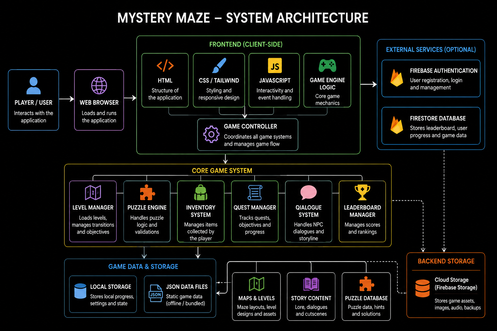

<h1 align="center">Mystery Maze</h1>
<h2 align="center">A web-based fantasy-themed puzzle and riddle-solving platform developed for the Digi Week Competition organized at J.C. Bose University of Science and Technology, YMCA.</h2>
<h2>Overview</h2>
<p>Mystery Maze is an interactive adventure game where participants solve riddles, progress through multiple locations, earn points, and compete on a live leaderboard. The platform was developed as part of a technical competition during Digi Week and combines storytelling, gamification, and logical problem-solving into a single experience.</p>
<p>The application allows participants to navigate through different stages, answer riddles, track their progress, and compete against other teams in real time.</p>
<h2>Competition Details</h2>
<table align="center">
    <tr>
        <th>Field</th>
        <th>Details</th>
    </tr>
    <tr>
        <td><b>Event</b></td>
        <td>Digi Week</td>
    </tr>
    <tr>
        <td><b>Organization</b></td>
        <td>J.C. Bose University of Science and Technology, YMCA</td>
    </tr>
    <tr>
        <td><b>Category</b></td>
        <td>Technical Competition</td>
    </tr>
    <tr>
        <td><b>Project Type</b></td>
        <td>Web Application</td>
    </tr>
    <tr>
        <td><b>Theme</b></td>
        <td>Harry Potter</td>
    </tr>
    <tr>
        <td><b>Mode</b></td>
        <td>Team Participation</td>
    </tr>
</table>
<h2>Features</h2>

* User Authentication
* Team Registration
* Interactive Riddle Challenges
* Multi-Level Gameplay
* Real-Time Leaderboard
* Score Tracking System
* Progress Saving
* Fantasy-Themed User Interface
* Firebase Cloud Integration
* Responsive Design
* Automatic Progress Recovery
* Dynamic Question Handling
<h2>Technology Stack</h2>
<h3>Frontend</h3>

* HTML5
* CSS3
* JavaScript (ES6)
<h3>Backend Services</h3>

* Firebase Authentication
* Cloud Firestore
<h3>Hosting and Deployment</h3>

* Vercel
<h3>Development Tools</h3>

* Visual Studio Code
* Git
* GitHub




<h2>Database Design</h2>
<h3>Collection: Users</h3>

```bash
{
  "uid": "user_id",
  "name": "Player Name",
  "email": "player@example.com",
  "score": 120,
  "currentLevel": 5
}
```
<h3>Collection: Team Scores</h3>

```bash
{
  "teamName": "Mystic Wizards",
  "score": 450
}
```
<h3>Collection: Riddles</h3>

```bash
{
  "id": "R1",
  "question": "Sample Riddle",
  "answer": "Sample Answer"
}
```
<h2>Installation</h2>
<h3>Clone Repository</h3>

```bash
git clone https://github.com/your-username/mystery-maze.git
cd mystery-maze
```
<h3>Install Dependencies</h3>

```bash
npm install
```
<h3>Configure Firebase</h3>
Create a Firebase Project and enable:

* Firebase Authentication
* Cloud Firestore
Replace the Firebase configuration with your own credentials.

```bash
const firebaseConfig = {
  apiKey: "YOUR_API_KEY",
  authDomain: "YOUR_PROJECT.firebaseapp.com",
  projectId: "YOUR_PROJECT_ID",
  storageBucket: "YOUR_PROJECT.appspot.com",
  messagingSenderId: "XXXXXXX",
  appId: "XXXXXXX"
};
```
<h3>Running the Project Locally</h3>
Start the development server:

```bash
npm run dev
```
Open:

```bash
http://localhost:5500
```
<h2>Deployment</h2>
<h3>Deploy on Vercel</h3>
Install Vercel CLI:

```bash
npm install -g vercel
```
<h3>Deploy:</h3>
<p>vercel</p>
<p>Production Deployment:</p>

```bash
vercel --prod
```
<h2>Screenshots</h2>


Login Page


Rules Page


Riddle Challenge Page


<h2>Future Enhancements</h2>

* Multiplayer Competition Mode
* Admin Dashboard
* AI Generated Riddles
* Hint and Reward System
* Achievement Badges
* Analytics Dashboard
* Mobile Application Version
* Tournament Management System

<h2>>Learning Outcomes</h2>

* Frontend Development using HTML, CSS, and JavaScript
* Firebase Authentication Integration
* Cloud Firestore Database Management
* Real-Time Data Handling
* Responsive UI Design
* Event-Based Web Application Development
* Team Collaboration and Project Management
<h2>Live Demo</h2>
```bash
https://mystermaze25-main.vercel.app
```

<h3>User Id</h3>

```bash
0
```
<h3>Team Name</h3>

```bash
Test
```
<h3>Password</h3>

```bash
0
```
<h2>License</h2>
This project was developed for educational and competition purposes during Digi Week at J.C. Bose University of Science and Technology, YMCA.